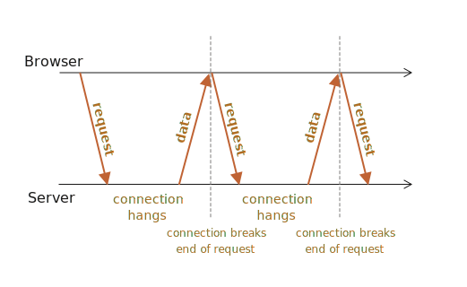

## TCP over Long-polling

Implementation of guaranteed message delivery using the TCP protocol over Long Polling in `Node.js`.



### Download all dependencies
```
   npm ci
```


### Then, start the application server
```
   npm run start
```

### Task details
1. Implement guaranteed message delivery over long polling for your custom TCP connection.
   - One party sends a set of messages to the other party.
   - Number the messages and assemble them together.
   - In case of any loss, initiate a re-request. If the re-request is successful, use the message only once.
   - If a message is not received after 3-5 attempts (as per the chosen variant), display an error to the user.

2. With a specified probability, one of the parties "forgets" to send a message (acknowledgment or useful message).

